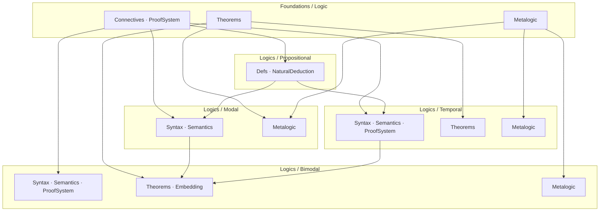

# Project Roadmap: Porting BimodalLogic to CSLib

This document describes the ongoing effort to extract and organize content from
the [BimodalLogic](https://github.com/benbrastmckie/BimodalLogic) repository
into four standalone CSLib modules: **Foundations/Logic**, **Modal**, **Temporal**,
and **Bimodal**. See `specs/TODO.md` for task tracking.

Beyond the original port, the Modal module now carries a full **metalogic grid**:
the three propositional bases (**minimal / intuitionistic / classical**) crossed with
the modal systems that extend each (the 15-system classical cube plus the minimal,
intuitionistic, and constructive families), with a systematic **conservative-extension**
framework tying them together and a **generic tableau decision procedure** shared across
systems. The current emphasis is *elegance and non-redundancy*: driving the grid to a
single shared abstraction per concern (one canonical model, one driver, one correspondence
library, one conservativity engine) rather than per-system copies. See
**Abstraction & Redundancy Cleanup** below for that agenda.

## Approach

Every component lives at the most general level it can compile at. Content is
distributed across five module levels — Foundations/Logic/, Logics/Propositional/,
Logics/Modal/, Logics/Temporal/, and Logics/Bimodal/. Foundations provides
shared infrastructure (connectives, proof systems, propositional theorems, MCS
theory). Propositional defines the base formula type and imports only from
Foundations. Modal and Temporal each import from both Foundations and
Propositional, establishing Propositional as a shared sub-logic. Bimodal
imports from all three peer modules and from Foundations directly.

## Module Dependency Structure

Imports flow downward through four layers: Foundations at top,
Propositional as the shared sub-logic, Modal and Temporal as
independent peers (both importing from Propositional), and Bimodal
at the bottom.



## Completed

### Shared infrastructure & propositional bases

| Component | Module |
|-----------|--------|
| Propositional Hilbert theorems (combinators, core, weakening, cut, big-conjunction) | `Foundations/Logic/Theorems/` |
| Generic metalogic substrate: `DerivationSystem`, `set_lindenbaum`, deduction theorem, MCS theory, prime exclusion | `Foundations/Logic/Metalogic/` |
| Abstract tableau substrate (signed formulas, branch, closure, measure) | `Foundations/Logic/Tableau/` |
| Proof-system morphism engine (`ProofSig`, `ProofSigHom`) — basis for all conservativity lifts | `Foundations/Logic/Metalogic/ProofSystemMorphism.lean` |
| Minimal / Intuitionistic / Classical propositional: Hilbert, ND (+ normalization), LJ/LK sequent calculus (cut-elim, interpolation), soundness, strong completeness, Lindenbaum | `Logics/Propositional/` |
| Propositional fragment conservativity chain + Glivenko (classical over intuitionistic) | `Logics/Propositional/Semantics/Algebra/` |

### Modal grid (bases × systems) — soundness & completeness, sorry-free

| Component | Module |
|-----------|--------|
| Classical modal cube: 15 systems (K,T,B,D,D4,D5,D45,DB,TB,K4,K5,K45,KB5,S4,S5) — thin instances of ONE generic canonical model | `Logics/Modal/Metalogic/Completeness.lean` + `Systems/<S>/` |
| Minimal modal (MK, MT, MS4, MS5) via frame-condition-generic extension | `Logics/Modal/Metalogic/Minimal/` |
| Intuitionistic modal (IK, IT, IS4, IS5) — birelational semantics, shared canonical model | `Logics/Modal/Metalogic/Intuitionistic/` |
| Constructive modal (CK, CT, CS4; CS5 in progress) — forcing semantics + labelled deduction | `Logics/Modal/Metalogic/Constructive/` |

### Conservative-extension framework (systematic, morphism-based)

| Component | Module |
|-----------|--------|
| Each cube system conservative over CPL (one parametric lemma) | `Logics/Modal/Metalogic/ConservativeExtension.lean` + `Systems/<S>/` |
| Inter-system subsumption lattice (24 edge theorems) + base-collapse into classical column | `Logics/Modal/Metalogic/InterSystem/` |
| Bimodal conservative over CPL / S5 / temporal (dense) | `Logics/Bimodal/Metalogic/ConservativeExtension/` |
| Temporal conservative over CPL | `Logics/Temporal/ConservativeExtension.lean` |

### Tableau decision procedures (generic driver)

| Component | Module |
|-----------|--------|
| Generic tableau driver `modalTableauGen` + `RuleApplicationSpec` interface | `Logics/Modal/Tableau/GenericDriver.lean` + `Saturation.lean` |
| Decidability instances (all sorry-free): T, B, TB, S5, 5/Euclidean, KB5, S4 | `Logics/Modal/Tableau/FrameCompleteness.lean` |
| Decidability instance: K | `Logics/Modal/Tableau/CompletenessLoop.lean` |
| Frame-condition ↔ axiom correspondence library (Phase 1) | `Logics/Modal/Metalogic/FrameCorrespondence.lean` |

**Matrix coverage (as of 2026-08-09)**: **8 of the 15** classical-cube systems have a `Decidable`
instance — K, T, B, TB, S5, K5/Five, KB5, S4. The remaining 7 corners (D, D4, D5, D45, DB, K4,
K45) have no instance yet; see the new **Modal Tableau Decidability** section under Remaining for
what gates them.

### Bimodal & Temporal (task/tense modality)

| Component | Module |
|-----------|--------|
| Bimodal: syntax, task-frame semantics, 42-axiom Hilbert, perpetuity, soundness, **dense** completeness, FMP + tableau decidability, separation theorem | `Logics/Bimodal/` |
| Temporal: syntax, semantics, 26-axiom BX proof system, soundness, completeness (+ dense), chronicle pipeline | `Logics/Temporal/` |
| Temporal tableau — **partial**: the tableau directory exists and is sorry-free (8 files, 4,269 lines: Branch, Closure, Completeness, Defs, Rules, Saturation, Soundness, TimeOrdering), but the owning tasks are non-terminal (301 `blocked`, 425 `not_started`) and task 301's own history marks `Completeness.lean`'s extractModel / structural branch lemmas `[PARTIAL]`; see the new **Temporal tableau** section under Remaining | `Logics/Temporal/Tableau/` |
| Bimodal embeddings (Propositional / Modal / Temporal) | `Logics/Bimodal/Embedding/` |

### Consolidation & completeness landed since the mid-2026 review

| Component | Module |
|-----------|--------|
| Intuitionistic-modal truth lemma — IK/IT/IS4/IS5 now fully sorry-free | `Logics/Modal/Metalogic/Intuitionistic/` |
| Constructive CS5 — **partial** toward CS5 ≡ IS5 completeness (labelled bounded-context): the anti-vacuity certificate `nik_TS5_consistent` has landed via a direct, self-contained one-point-model route; the general labelled soundness direction `nik_TS5_soundness` has **not** landed (per `Labelled/Soundness.lean`'s own module docstring, re-read 2026-08-09: the tree-shape invariant and graph-lifting machinery are outstanding and were assessed intractable at standard effort). See the new **Constructive CS5** section under Remaining | `Logics/Modal/Metalogic/Constructive/` |
| 14 `Systems/<S>/Soundness.lean` consumers wired to the correspondence library | `Logics/Modal/Metalogic/FrameCorrespondence.lean` |
| Schema-union axiom combinator replacing 14 hand-written per-system axiom inductives | `Logics/Modal/ProofSystem/Instances/` |
| Single generic canonical-model truth lemma (the three-way `k_`/`d_`/plain split retired) | `Logics/Modal/Metalogic/Completeness.lean` |
| Wrap/unwrap propositional-combinator bridge layers retired across three families | `Foundations/Logic/Theorems/` |
| Lindenbaum/MCS/conservativity consolidation onto shared generic-MCS + morphism-lift machinery | `Foundations/Logic/Metalogic/` |
| KB5 `'`/`''` tableau rule variants merged into one rule | `Logics/Modal/Tableau/` |
| LTL ↔ Temporal semantic-preservation bridge | `Logics/LTL/` |
| Validity/derivability naming and notation unified; stale `[BLOCKED]` docstrings and task provenance stripped | repo-wide |
| BX+ metric tense base + completeness over group flows | `Logics/Bimodal/Metalogic/` |
| CI honesty gates: sorry-suppression, axiom-census, shake-residue and lint-suppression ratchets | `scripts/`, `.github/workflows/` |
| **S4** loop-checking termination bound + decidability (`instDecidableS4Valid`) — the last classical-cube corner tracked as a standalone Remaining row (511 → 506 → umbrella 300, all terminal) | `Logics/Modal/Tableau/FrameCompleteness.lean` |
| **TB** decidability corner (`instDecidableTBValid`) — task 548, `completed` (scope-narrowed) | `Logics/Modal/Tableau/FrameCompleteness.lean` |
| Modal tableau refactor programme (private-dedup, `RuleApplySt` ladder, box-plus birth keys, S4-keyed migration, `LoopChecking.lean` split into 10 `Modal/Tableau/S4/*.lean` modules, `Boneyard/` quarantine, acceptance gate) — all 8 subtasks terminal (557 expanded → 558, 562-567 completed). `LoopChecking.lean` itself is now **2,216 lines / 15 declarations as of 2026-08-09** (not the pre-split 10,723/230, and still moving — task 600 is open against it, retiring the remaining unordered stepper stack); the 10 `S4/*.lean` modules plus `LoopChecking.lean` combined total 12,510 lines | `Modal/Tableau/` |
| `Foundations/Logic/Tableau/Blocking.lean` — label-generic Sfor-containment/subset-blocking module (202 lines, 10 declarations) | `Foundations/Logic/Tableau/Blocking.lean` |
| Proof-style simplification over existing normalization lemmas (propositional / modal family) | repo-wide |
| Chronicle consolidation (task 530) — **partial**: `ChronicleInterface` skeleton, generic `ChronicleTypes`, shared `RRelation` core, and `CEE` Structures + `BurgessHelpers` landed and are sorry-free. Phases 3b/3c/4a/4b (generic lifting of `c5ForwardWalk`/`c5BackwardWalk`, the elimination driver, and `ChronicleConstruction`) were formally **descoped** by an explicit 2026-07-26 user decision: two independent investigations confirmed that generically bridging types indexed by each tree's locally-indexed Chronicle `Atom` structure breaks downstream `rcases`/`simp` proofs. The ~89% Chronicle duplication between Bimodal and Temporal is **not resolved**; task 41 still holds the "abstract shared completeness infrastructure" obligation (`not_started`) and task 568 (`blocked`) was created to research the highest-quality follow-on refactor | `Foundations/Logic/Metalogic/Chronicle/` |

## Remaining

### A. Completeness / decidability gaps

Verified sorry counts (re-verified as of 2026-08-09): **26** code-position sorries repo-wide —
Bimodal 23, Propositional 3, Modal 0. Temporal, LTL, HML, LinearLogic and Foundations are
sorry-free. The Bimodal 23 are all `warn.sorry`-suppressed; the Propositional 3 are **bare**, and
are the stated reason `lake build --wfail --iofail` is red on this tree.

*(Note: `.claude/scripts/lean-sorry-census.sh` currently over-counts by one per `warn.sorry`
suppression site — the figure above excludes those and reflects genuine `sorry` occurrences
only; see task 608.)*

| Item | Tracking | Notes |
|------|----------|-------|
| Pure-K5 / pure-5 Euclidean completeness (no equivalence route) | 534 | corner deferred out of the KB5/Euclidean task; task 534 is `not_started` (as of 2026-08-09) |
| Propositional tableau completeness (**3 sorries**, as of 2026-08-09) + atom-persistence lemma | 593 → 601, 602, 603, 604, 605, 606 | the original tracking chain (574 → 456 → 317, 430, 583) is now fully terminal (574, 456, 317, 430 completed; 583 abandoned) with no successor named on the roadmap; the live sorries it was tracking are now owned by task 593's expansion tree — 601/602/603/604 completed, 605/606 not started. Task 604 discharged the `truthLemma` T-imp sorry (DP-5) and restructured `openBranch_countermodel`, taking `Intuitionistic/Scheme.lean` from 2 sorries to 1, so the remaining 3 are `Intuitionistic/Scheme.lean` ×1, `Intuitionistic/Completeness.lean`, `Minimal/Completeness.lean`. Scheme.lean's surviving sorry is the **open** existential (`∃ edges, upward-closed ∧ ¬IForces`); the frames previously tried for it are machine-**refuted**, with root cause `intFImpReuseWitnessAnc?` in `Expansion.lean` tracked as task 609 |
| **S4 keyed loop-check guard soundness** — DISCHARGED BY REFUTATION | 553 → 582 | both terminal (archived); the standalone ancestor-redirect route's statement was false (explicit countermodel), not merely unproven; the lemma was deleted and the soundness obligation is discharged sorry-free by `branchSatisfiableIn_s4FC_addEdge_of_blocked` + the `S4RedirectSoundInv` family — see `FrameSoundness.lean`'s `accPinnedBy` module comment and the regression witness `CslibTests/AncestorRedirectRefutation.lean` |
| Bimodal **discrete** completeness pipeline (**23 sorries** as of 2026-08-09, split BXCanonical 13 / Bundle 9 / TemporalConservativity 1) | 36, 37, 215, 571 | gated on external BimodalLogic port; the *dense* pipeline is complete. BXCanonical (13: `ChronicleToCountermodel.lean` 12 + `Frame.lean` 1) is owned by task 215; Bundle (9: `SuccRelation.lean` 7 + `UntilSinceCoherence.lean` 2, the strict Until/Since gap) is owned by task 571 (`blocked`, not previously named on this roadmap); the 1-sorry TemporalConservativity group is broken out as its own row below (task 450) |
| Bimodal → temporal conservativity (1 sorry) | 450 | domain mismatch: bimodal soundness needs `AddCommGroup D`, temporal completeness an arbitrary serial linear order; task 450 `not_started` |

### B. Abstraction & Redundancy Cleanup

As of 2026-08-09 four of the five items previously tracked here have landed (moved to
Completed above: the modal tableau refactor programme, the Chronicle consolidation, the
`Blocking.lean` generalization, and the proof-style simplification pair). One item remains
outstanding:

| Cleanup | Tracking | Target |
|---------|----------|--------|
| Fold tableau edges into the propositional proof-system TFAE (sequent edges already done) | 375 | `Propositional/ProofSystemEquivalence.lean`; task 375 `not_started` (as of 2026-08-09) |

**Open decision:** the three bimodal completeness constructions — `Algebraic` + `Bundle` form the
wired pipeline; `BXCanonical` is an incomplete leaf (13 sorries, as of 2026-08-09 — see task 607)
nothing downstream imports. Task 607 (created 2026-08-09) tracks the decision: complete
`BXCanonical/dense`, or abandon it and consolidate onto the algebraic pipeline. The decision is
tracked, not made, by this roadmap pass.

### C. Lifting to shared temporal/bimodal completeness

| Item | Tracking |
|------|----------|
| Continuous / discrete temporal completeness | 39 (`not_started`, discrete), 40 (`blocked`, continuous); see also Bimodal port gates 36/37 |
| Whether continuous time needs axioms beyond density (Burgess 1982) | 569 (`not_started`) |
| Abstract shared completeness infrastructure across Temporal + Bimodal | **not** folded into 530 — the Chronicle consolidation closed as a descoped partial (see Completed → "Consolidation & completeness landed since the mid-2026 review" for what shipped and what didn't). The obligation is still held by task 41 (`not_started`); task 568 (`blocked`) researches the follow-on refactor; task 576 (`not_started`) resolves the Chronicle namespace/structure name coincidence |

### Modal Tableau Decidability

The classical-cube decidability matrix is **8 of 15** systems complete (K, T, B, TB, S5, K5/Five,
KB5, S4 — see Completed → "Tableau decision procedures" above). Task 548 (`completed`,
scope-narrowed) established that the remaining 7 corners — **D, D4, D5, D45, DB, K4, K45** — have
no `Decidable` instance, gated on a seriality/`RuleApplicationSpec` spec-shape blocker for D-type
frames. Successor work:

| Item | Tracking |
|------|----------|
| Decide the tableau driver abstraction across termination regimes (foundation for the D-type gate) | 597 (`completed`), 598 (`completed`) |
| Prototype the Euclidean rule combinator identified as an open, unowned gate | 599 (`not_started`) |
| Retire the unordered S4 stepper stack at `LoopChecking.lean` | 600 (`not_started`) |

This section implements the recommendation from `specs/ROADMAP-alignment-audit.md:79`, previously
unapplied.

### Constructive CS5

Constructive modal logic (`Logics/Modal/Metalogic/Constructive/`) has landed CK, CT, CS4
completeness. For CS5, only the anti-vacuity certificate `nik_TS5_consistent` has landed (via a
direct one-point-model route); the general labelled soundness direction `nik_TS5_soundness` has
**not** — the tree-shape invariant and graph-lifting machinery remain outstanding, and the
direct-induction route was assessed intractable at standard effort pending a genuine open
mathematical question (`Labelled/Soundness.lean` module docstring, re-read 2026-08-09).

| Item | Tracking |
|------|----------|
| Prove the general labelled soundness direction `nik_TS5_soundness` | 537 (`blocked`) |
| Deliver native Hilbert canonical-model completeness for constructive CS5 (fallible-world route) | 551 (`blocked`) |
| CS5 path research (rescoped 2026-07-26 per user decision) | 554 (`blocked`) |

### Temporal tableau

`Logics/Temporal/Tableau/` exists and is sorry-free as of 2026-08-09 (8 files, 4,269 lines:
Branch, Closure, Completeness, Defs, Rules, Saturation, Soundness, TimeOrdering), but the owning
tasks remain open — task 301's own commit history marks `Completeness.lean`'s `extractModel` and
structural branch lemmas `[PARTIAL]`.

| Item | Tracking |
|------|----------|
| Tableau decision procedure for temporal logic (until/since) | 301 (`blocked`) |
| Successor work decomposed from the temporal tableau umbrella (blocker C, cleared 2026-07-26) | 425 (`not_started`) |

### Propositional upstream

Foundational work on the Propositional layer that Modal/Temporal/Bimodal all build on:

| Item | Tracking |
|------|----------|
| Unbundle connective typeclasses; reconcile with fmontesi PR #607 | 400 (`not_started`) |
| Reconcile `imp` vs `impl` naming in `Cslib/Logics/Propositional` | 497 (`not_started`) |
| Literal ⊥-rule-free base ND inductive (option B): split MinDerivation + Explosion | 409 (`blocked`) |

### Deliberately excluded from this roadmap (as of 2026-08-09)

The following open tasks are housekeeping, meta, or reconciliation work rather than
formalization content, and are intentionally not given roadmap rows — recorded here so a future
audit does not re-flag them as omissions:

| Task | Reason for exclusion |
|------|----------------------|
| 181 | Bimodal primitive-connective propagation (diamond/allFuture/allPast) — syntax-layer housekeeping ahead of a concrete driving use case |
| 588 | Resolve five import-reachability duplicate families — repo hygiene, not formalization content |
| 589 | Fix repo-wide `unusedArguments` lint findings — lint hygiene |
| 590 | Re-establish six out-of-tree probe verdicts — internal verification housekeeping |
| 591, 592, 593 | Superseded by their own children (601-606); see the Propositional tableau completeness row above |
| 594, 595 | Meta reconciliation tasks (task-record audit, dependency-integrity gate) |
| 596 | This very reconciliation task |

### Open-task roadmap coverage (as of 2026-08-09)

Before this pass: **10 of 46** open tasks (per the `specs/state.json` `active_projects` count,
which includes some terminal-status entries not yet swept by `/todo`) had roadmap presence.
After this pass: **all 46** are named somewhere in this document — either as a substantive
Remaining/Completed row, or, for the housekeeping/meta/superseded tasks, in the
"Deliberately excluded" table above with a stated reason. Use the 46-task, fully-covered baseline
for the next audit; a task created after 2026-08-09 starts uncovered until it is either given a
row or added to the exclusion table.

## Project Structure

The logic library lives in two directory trees within `Cslib/`:

```
Cslib/
├── Foundations/
│   └── Logic/
│       ├── Connectives.lean
│       ├── ProofSystem.lean
│       ├── InferenceSystem.lean
│       ├── LogicalEquivalence.lean
│       ├── Axioms.lean
│       ├── Theorems.lean
│       ├── Theorems/
│       │   ├── Propositional/
│       │   │   ├── Core.lean
│       │   │   └── Connectives.lean
│       │   ├── Modal/
│       │   │   ├── Basic.lean
│       │   │   └── S5.lean
│       │   ├── BigConj.lean
│       │   └── Combinators.lean
│       └── Metalogic/
│           ├── Consistency.lean
│           └── DeductionHelpers.lean
└── Logics/
    ├── Modal/
    │   ├── Basic.lean
    │   ├── Cube.lean
    │   ├── Denotation.lean
    │   ├── Metalogic.lean
    │   └── Metalogic/
    │       ├── DerivationTree.lean
    │       ├── DeductionTheorem.lean
    │       ├── MCS.lean
    │       ├── Soundness.lean
    │       └── Completeness.lean
    ├── Temporal/
    │   ├── Syntax/
    │   │   ├── Formula.lean
    │   │   ├── Context.lean
    │   │   ├── BigConj.lean
    │   │   └── Subformulas.lean
    │   ├── Semantics/
    │   │   ├── Model.lean
    │   │   ├── Satisfies.lean
    │   │   └── Validity.lean
    │   ├── ProofSystem.lean
    │   ├── ProofSystem/
    │   │   ├── Axioms.lean
    │   │   ├── Derivation.lean
    │   │   ├── Derivable.lean
    │   │   └── Instances.lean
    │   ├── Theorems.lean
    │   ├── Theorems/
    │   │   ├── TemporalDerived.lean
    │   │   └── FrameConditions.lean
    │   ├── Metalogic.lean
    │   └── Metalogic/
    │       ├── DerivationTree.lean
    │       ├── DeductionTheorem.lean
    │       ├── MCS.lean
    │       ├── Soundness.lean
    │       ├── Completeness.lean
    │       ├── TemporalContent.lean
    │       ├── WitnessSeed.lean
    │       ├── PropositionalHelpers.lean
    │       ├── GeneralizedNecessitation.lean
    │       ├── CompletenessHelpers.lean
    │       └── Chronicle/
    │           ├── ChronicleTypes.lean
    │           ├── RRelation.lean
    │           ├── Frame.lean
    │           ├── CanonicalChain.lean
    │           ├── OrderedSeedConsistency.lean
    │           ├── PointInsertion.lean
    │           ├── ChronicleConstruction.lean
    │           ├── CounterexampleElimination.lean
    │           ├── TruthLemma.lean
    │           └── ChronicleToCountermodel.lean
    └── Bimodal/
        ├── Syntax/
        │   ├── Formula.lean
        │   ├── Context.lean
        │   ├── Subformulas.lean
        │   ├── SubformulaClosure.lean
        │   └── SubformulaClosure/
        ├── Semantics/
        │   ├── TaskFrame.lean
        │   ├── WorldHistory.lean
        │   ├── TaskModel.lean
        │   ├── Truth.lean
        │   └── Validity.lean
        ├── ProofSystem/
        │   ├── Axioms.lean
        │   ├── Derivation.lean
        │   ├── Derivable.lean
        │   ├── Instances.lean
        │   ├── LinearityDerivedFacts.lean
        │   └── Substitution.lean
        ├── Theorems/
        │   ├── Combinators.lean
        │   ├── GeneralizedNecessitation.lean
        │   ├── TemporalDerived.lean
        │   ├── Propositional/
        │   └── Perpetuity/
        ├── FrameConditions/
        ├── Embedding/
        │   ├── PropositionalEmbedding.lean
        │   ├── ModalEmbedding.lean
        │   └── TemporalEmbedding.lean
        └── Metalogic/
            ├── Core.lean
            ├── Core/
            ├── Soundness/
            ├── Bundle/
            ├── Algebraic/
            ├── BXCanonical/
            ├── Separation/
            ├── ConservativeExtension/
            ├── Decidability/
            │   └── FMP/
            └── Completeness.lean
```
