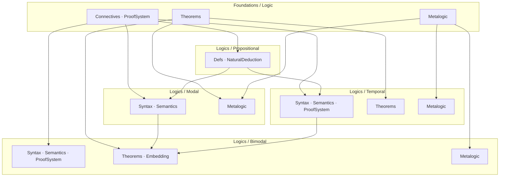

# Project Roadmap: Porting BimodalLogic to CSLib

This document describes the ongoing effort to extract and organize content from
the [BimodalLogic](https://github.com/benbrastmckie/BimodalLogic) repository
into four standalone CSLib modules: **Foundations/Logic**, **Modal**, **Temporal**,
and **Bimodal**. See `specs/TODO.md` for task tracking.

Beyond the original port, the Modal module now carries a full **metalogic grid**:
the three propositional bases (**minimal / intuitionistic / classical**) crossed with
the modal systems that extend each (the 15-system classical cube plus the minimal,
intuitionistic, and constructive families), with a systematic **conservative-extension**
framework tying them together and a **generic tableau decision procedure** shared across
systems. The current emphasis is *elegance and non-redundancy*: driving the grid to a
single shared abstraction per concern (one canonical model, one driver, one correspondence
library, one conservativity engine) rather than per-system copies. See
**Abstraction & Redundancy Cleanup** below for that agenda.

## Approach

Every component lives at the most general level it can compile at. Content is
distributed across five module levels — Foundations/Logic/, Logics/Propositional/,
Logics/Modal/, Logics/Temporal/, and Logics/Bimodal/. Foundations provides
shared infrastructure (connectives, proof systems, propositional theorems, MCS
theory). Propositional defines the base formula type and imports only from
Foundations. Modal and Temporal each import from both Foundations and
Propositional, establishing Propositional as a shared sub-logic. Bimodal
imports from all three peer modules and from Foundations directly.

## Module Dependency Structure

Imports flow downward through four layers: Foundations at top,
Propositional as the shared sub-logic, Modal and Temporal as
independent peers (both importing from Propositional), and Bimodal
at the bottom.



## Completed

### Shared infrastructure & propositional bases

| Component | Module |
|-----------|--------|
| Propositional Hilbert theorems (combinators, core, weakening, cut, big-conjunction) | `Foundations/Logic/Theorems/` |
| Generic metalogic substrate: `DerivationSystem`, `set_lindenbaum`, deduction theorem, MCS theory, prime exclusion | `Foundations/Logic/Metalogic/` |
| Abstract tableau substrate (signed formulas, branch, closure, measure) | `Foundations/Logic/Tableau/` |
| Proof-system morphism engine (`ProofSig`, `ProofSigHom`) — basis for all conservativity lifts | `Foundations/Logic/Metalogic/ProofSystemMorphism.lean` |
| Minimal / Intuitionistic / Classical propositional: Hilbert, ND (+ normalization), LJ/LK sequent calculus (cut-elim, interpolation), soundness, strong completeness, Lindenbaum | `Logics/Propositional/` |
| Propositional fragment conservativity chain + Glivenko (classical over intuitionistic) | `Logics/Propositional/Semantics/Algebra/` |

### Modal grid (bases × systems) — soundness & completeness, sorry-free

| Component | Module |
|-----------|--------|
| Classical modal cube: 15 systems (K,T,B,D,D4,D5,D45,DB,TB,K4,K5,K45,KB5,S4,S5) — thin instances of ONE generic canonical model | `Logics/Modal/Metalogic/Completeness.lean` + `Systems/<S>/` |
| Minimal modal (MK, MT, MS4, MS5) via frame-condition-generic extension | `Logics/Modal/Metalogic/Minimal/` |
| Intuitionistic modal (IK, IT, IS4, IS5) — birelational semantics, shared canonical model | `Logics/Modal/Metalogic/Intuitionistic/` |
| Constructive modal (CK, CT, CS4; CS5 in progress) — forcing semantics + labelled deduction | `Logics/Modal/Metalogic/Constructive/` |

### Conservative-extension framework (systematic, morphism-based)

| Component | Module |
|-----------|--------|
| Each cube system conservative over CPL (one parametric lemma) | `Logics/Modal/Metalogic/ConservativeExtension.lean` + `Systems/<S>/` |
| Inter-system subsumption lattice (24 edge theorems) + base-collapse into classical column | `Logics/Modal/Metalogic/InterSystem/` |
| Bimodal conservative over CPL / S5 / temporal (dense) | `Logics/Bimodal/Metalogic/ConservativeExtension/` |
| Temporal conservative over CPL | `Logics/Temporal/ConservativeExtension.lean` |

### Tableau decision procedures (generic driver)

| Component | Module |
|-----------|--------|
| Generic tableau driver `modalTableauGen` + `RuleApplicationSpec` interface | `Logics/Modal/Tableau/GenericDriver.lean` + `Saturation.lean` |
| Decidability instances: K, T, B, S5, 5/Euclidean, KB5 (all sorry-free) | `Logics/Modal/Tableau/FrameCompleteness.lean` |
| Frame-condition ↔ axiom correspondence library (Phase 1) | `Logics/Modal/Metalogic/FrameCorrespondence.lean` |

### Bimodal & Temporal (task/tense modality)

| Component | Module |
|-----------|--------|
| Bimodal: syntax, task-frame semantics, 42-axiom Hilbert, perpetuity, soundness, **dense** completeness, FMP + tableau decidability, separation theorem | `Logics/Bimodal/` |
| Temporal: syntax, semantics, 26-axiom BX proof system, soundness, completeness (+ dense), tableau, chronicle pipeline | `Logics/Temporal/` |
| Bimodal embeddings (Propositional / Modal / Temporal) | `Logics/Bimodal/Embedding/` |

### Consolidation & completeness landed since the mid-2026 review

| Component | Module |
|-----------|--------|
| Intuitionistic-modal truth lemma — IK/IT/IS4/IS5 now fully sorry-free | `Logics/Modal/Metalogic/Intuitionistic/` |
| Constructive **CS5 ≡ IS5** completeness (labelled bounded-context) — the constructive capstone | `Logics/Modal/Metalogic/Constructive/` |
| 14 `Systems/<S>/Soundness.lean` consumers wired to the correspondence library | `Logics/Modal/Metalogic/FrameCorrespondence.lean` |
| Schema-union axiom combinator replacing 14 hand-written per-system axiom inductives | `Logics/Modal/ProofSystem/Instances/` |
| Single generic canonical-model truth lemma (the three-way `k_`/`d_`/plain split retired) | `Logics/Modal/Metalogic/Completeness.lean` |
| Wrap/unwrap propositional-combinator bridge layers retired across three families | `Foundations/Logic/Theorems/` |
| Lindenbaum/MCS/conservativity consolidation onto shared generic-MCS + morphism-lift machinery | `Foundations/Logic/Metalogic/` |
| KB5 `'`/`''` tableau rule variants merged into one rule | `Logics/Modal/Tableau/` |
| LTL ↔ Temporal semantic-preservation bridge | `Logics/LTL/` |
| Validity/derivability naming and notation unified; stale `[BLOCKED]` docstrings and task provenance stripped | repo-wide |
| BX+ metric tense base + completeness over group flows | `Logics/Bimodal/Metalogic/` |
| CI honesty gates: sorry-suppression, axiom-census, shake-residue and lint-suppression ratchets | `scripts/`, `.github/workflows/` |

## Remaining

### A. Completeness / decidability gaps

Verified sorry counts (2026-07-28): **28** code-position sorries repo-wide — Bimodal 23,
Propositional 4, Modal 1. Temporal, LTL, HML, LinearLogic and Foundations are sorry-free.
The Bimodal 23 are all `warn.sorry`-suppressed; the Propositional 4 and Modal 1 are **bare**,
and are the stated reason `lake build --wfail --iofail` is red on this tree.

| Item | Tracking | Notes |
|------|----------|-------|
| **S4** (reflexive-transitive) loop-checking termination bound + decidability | 511 → 506 → umbrella 300 | the last classical-cube decidability corner; `2^\|Sf\|` bound. Gated on the box-plus birth-keys task (563) |
| Pure-K5 / pure-5 Euclidean completeness (no equivalence route) | 534 | corner deferred out of the KB5/Euclidean task |
| Propositional tableau completeness (**4 sorries**) + atom-persistence lemma | 574 → 456 → 317, 430, 583 | all four share one root cause: the fuel-bounded persistence loop in `applyAllTImpRules`. 583 owns the one lemma that is false as stated and needs restating |
| **S4 keyed loop-check guard soundness** (1 sorry, the only Modal one) | 553 → 582 | `branchSatisfiableIn_s4FC_ancestor_redirect`. The cited source (Massacci 2000, Thm 8.1) states the result and never proves it — see the in-file docstring |
| Bimodal **discrete** completeness pipeline (**23 sorries**) | 36, 37, 215 | gated on external BimodalLogic port; the *dense* pipeline is complete |
| Bimodal → temporal conservativity (1 sorry) | 450 | domain mismatch: bimodal soundness needs `AddCommGroup D`, temporal completeness an arbitrary serial linear order |

### B. Abstraction & Redundancy Cleanup (current priority — elegance & non-redundancy)

The metalogic grid is built; the focus now is collapsing residual duplication so each concern
has a single shared abstraction. Confirmed duplication and its tracking:

| Cleanup | Tracking | Target |
|---------|----------|--------|
| **Modal tableau refactor programme** (tasks A–I): private-dedup, `RuleApplySt` ladder, box-plus birth keys, S4-keyed migration, `LoopChecking.lean` split, `Boneyard/` quarantine, acceptance gate | 557 (expanded) → 558, 562, 563, 564, 565, 566, 567 | `Modal/Tableau/`; `LoopChecking.lean` alone is 10,723 lines / 230 declarations |
| Consolidate the duplicated Chronicle construction (bimodal vs temporal, ~89% overlap, 8 shared filenames) | 530 | shared `Foundations/Logic/Metalogic/Chronicle/` module |
| Fold tableau edges into the propositional proof-system TFAE (sequent edges already done) | 375 | `Propositional/ProofSystemEquivalence.lean` |
| Generalize the Sfor-containment / subset-blocking device into one label-generic module | 456 | `Foundations/Logic/Tableau/Blocking.lean` (new) |
| Proof-style simplification over existing normalization lemmas (propositional / modal family) | 413, 414 | decoupled from the abandoned co-tag task; lower priority |

**Open decision (no task yet):** the three bimodal completeness constructions — `Algebraic` +
`Bundle` form the wired pipeline; `BXCanonical` is an incomplete leaf (14 sorries) nothing
downstream imports. A future task should either complete `BXCanonical/dense` or abandon it and
consolidate onto the algebraic pipeline.

### C. Lifting to shared temporal/bimodal completeness

| Item | Tracking |
|------|----------|
| Continuous / discrete temporal completeness | (see Bimodal port gates 36/37) |
| Abstract shared completeness infrastructure across Temporal + Bimodal | folded into 530 (chronicle consolidation) |

## Project Structure

The logic library lives in two directory trees within `Cslib/`:

```
Cslib/
├── Foundations/
│   └── Logic/
│       ├── Connectives.lean
│       ├── ProofSystem.lean
│       ├── InferenceSystem.lean
│       ├── LogicalEquivalence.lean
│       ├── Axioms.lean
│       ├── Theorems.lean
│       ├── Theorems/
│       │   ├── Propositional/
│       │   │   ├── Core.lean
│       │   │   └── Connectives.lean
│       │   ├── Modal/
│       │   │   ├── Basic.lean
│       │   │   └── S5.lean
│       │   ├── BigConj.lean
│       │   └── Combinators.lean
│       └── Metalogic/
│           ├── Consistency.lean
│           └── DeductionHelpers.lean
└── Logics/
    ├── Modal/
    │   ├── Basic.lean
    │   ├── Cube.lean
    │   ├── Denotation.lean
    │   ├── Metalogic.lean
    │   └── Metalogic/
    │       ├── DerivationTree.lean
    │       ├── DeductionTheorem.lean
    │       ├── MCS.lean
    │       ├── Soundness.lean
    │       └── Completeness.lean
    ├── Temporal/
    │   ├── Syntax/
    │   │   ├── Formula.lean
    │   │   ├── Context.lean
    │   │   ├── BigConj.lean
    │   │   └── Subformulas.lean
    │   ├── Semantics/
    │   │   ├── Model.lean
    │   │   ├── Satisfies.lean
    │   │   └── Validity.lean
    │   ├── ProofSystem.lean
    │   ├── ProofSystem/
    │   │   ├── Axioms.lean
    │   │   ├── Derivation.lean
    │   │   ├── Derivable.lean
    │   │   └── Instances.lean
    │   ├── Theorems.lean
    │   ├── Theorems/
    │   │   ├── TemporalDerived.lean
    │   │   └── FrameConditions.lean
    │   ├── Metalogic.lean
    │   └── Metalogic/
    │       ├── DerivationTree.lean
    │       ├── DeductionTheorem.lean
    │       ├── MCS.lean
    │       ├── Soundness.lean
    │       ├── Completeness.lean
    │       ├── TemporalContent.lean
    │       ├── WitnessSeed.lean
    │       ├── PropositionalHelpers.lean
    │       ├── GeneralizedNecessitation.lean
    │       ├── CompletenessHelpers.lean
    │       └── Chronicle/
    │           ├── ChronicleTypes.lean
    │           ├── RRelation.lean
    │           ├── Frame.lean
    │           ├── CanonicalChain.lean
    │           ├── OrderedSeedConsistency.lean
    │           ├── PointInsertion.lean
    │           ├── ChronicleConstruction.lean
    │           ├── CounterexampleElimination.lean
    │           ├── TruthLemma.lean
    │           └── ChronicleToCountermodel.lean
    └── Bimodal/
        ├── Syntax/
        │   ├── Formula.lean
        │   ├── Context.lean
        │   ├── Subformulas.lean
        │   ├── SubformulaClosure.lean
        │   └── SubformulaClosure/
        ├── Semantics/
        │   ├── TaskFrame.lean
        │   ├── WorldHistory.lean
        │   ├── TaskModel.lean
        │   ├── Truth.lean
        │   └── Validity.lean
        ├── ProofSystem/
        │   ├── Axioms.lean
        │   ├── Derivation.lean
        │   ├── Derivable.lean
        │   ├── Instances.lean
        │   ├── LinearityDerivedFacts.lean
        │   └── Substitution.lean
        ├── Theorems/
        │   ├── Combinators.lean
        │   ├── GeneralizedNecessitation.lean
        │   ├── TemporalDerived.lean
        │   ├── Propositional/
        │   └── Perpetuity/
        ├── FrameConditions/
        ├── Embedding/
        │   ├── PropositionalEmbedding.lean
        │   ├── ModalEmbedding.lean
        │   └── TemporalEmbedding.lean
        └── Metalogic/
            ├── Core.lean
            ├── Core/
            ├── Soundness/
            ├── Bundle/
            ├── Algebraic/
            ├── BXCanonical/
            ├── Separation/
            ├── ConservativeExtension/
            ├── Decidability/
            │   └── FMP/
            └── Completeness.lean
```
